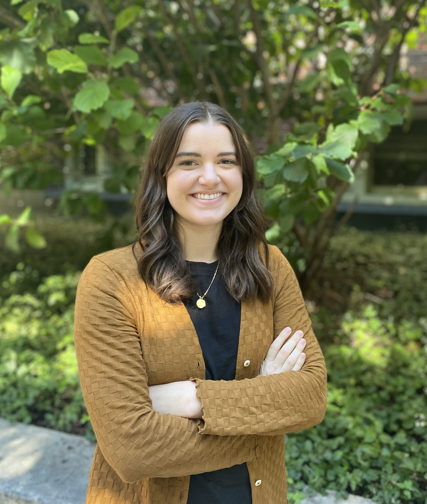

::: {.columns}

::: {.column width="45%" .text-center}
{width=80%}

::: {.d-flex .justify-content-center .gap-2 .mt-3 .align-items-center}

<!-- Email -->
<a href="mailto:sarah_kiefer@brown.edu" class="btn btn-outline-secondary btn-sm">
  <i class="bi bi-envelope fs-5"></i>
</a>

<!-- Google Scholar -->
<a href="https://scholar.google.com/citations?user=5Xpo9nMAAAAJ" class="btn btn-outline-secondary btn-sm">
  <i class="bi bi-google fs-5"></i>
</a>

<!-- Bluesky -->
<a href="https://bsky.app/profile/sarahkiefer.bsky.social" class="btn btn-outline-secondary btn-sm">
  
    <svg xmlns="http://www.w3.org/2000/svg" fill="currentColor" class="bi bi-bluesky" viewBox="0 0 16 16" width="1em" height="1em">
      <path d="M3.468 1.948C5.303 3.325 7.276 6.118 8 7.616c.725-1.498 2.698-4.29 4.532-5.668C13.855.955 16 .186 16 2.632c0 .489-.28 4.105-.444 4.692-.572 2.04-2.653 2.561-4.504 2.246 3.236.551 4.06 2.375 2.281 4.2-3.376 3.464-4.852-.87-5.23-1.98-.07-.204-.103-.3-.103-.218 0-.081-.033.014-.102.218-.379 1.11-1.855 5.444-5.231 1.98-1.778-1.825-.955-3.65 2.28-4.2-1.85.315-3.932-.205-4.503-2.246C.28 6.737 0 3.12 0 2.632 0 .186 2.145.955 3.468 1.948"/>
    </svg>
  
</a>

<!-- GitHub -->
<a href="https://github.com/slkiefer" class="btn btn-outline-secondary btn-sm">
  <i class="bi bi-github fs-5"></i>
</a>

<!-- LinkedIn -->
<a href="https://www.linkedin.com/in/sarahlkiefer/" class="btn btn-outline-secondary btn-sm">
  <i class="bi bi-linkedin fs-5"></i>
</a>

:::

:::

::: {.column width="55%"}

## Sarah L. Kiefer, M.Sc.

I am a Ph.D. student at Brown University in the [**Department of Cognitive & Psychological Sciences**](https://www.brown.edu/academics/cognitive-linguistic-psychological-sciences/home). I work with Dr. Dave Sobel in the [**Causality and Mind Lab**](https://sites.brown.edu/causalityandmindlab/).

My research examines how children navigate engaging with challenges across development. Specifically, I am interested in exploring how children’s decisions to persist are informed by an integration of individual, situational, and social factors.

Prior to Brown, I graduated from Arizona State University in 2019 with a B.S. in Psychology. After, I worked as a research coordinator at the Southwest Autism Research and Resource Center (SARRC) and then as a Lab Manager of the [**Emerging Minds Lab**](https://www.emergingmindslab.org/) at Arizona State University.

:::

:::
